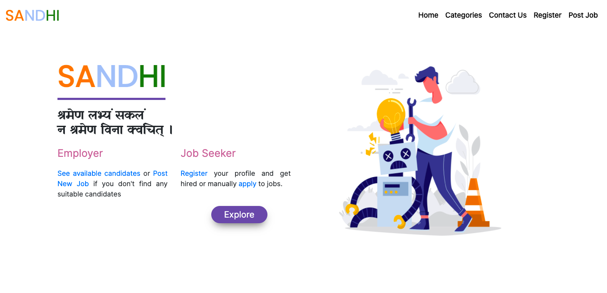
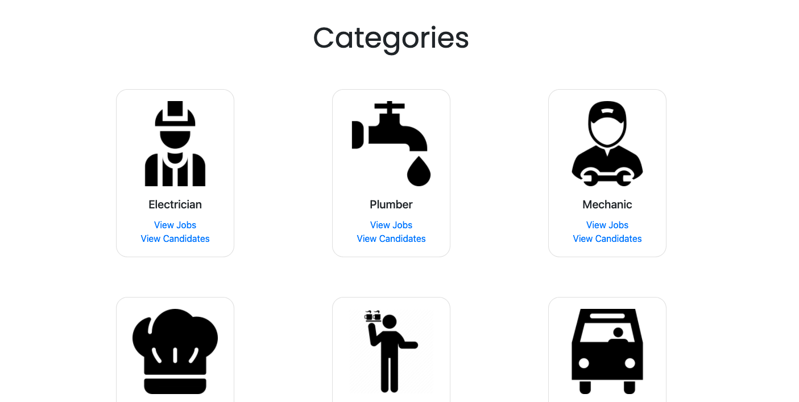
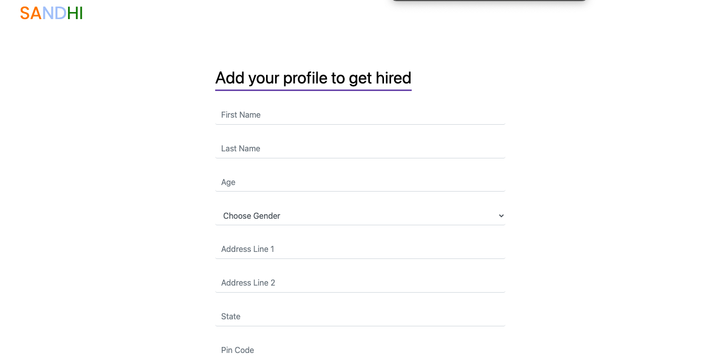
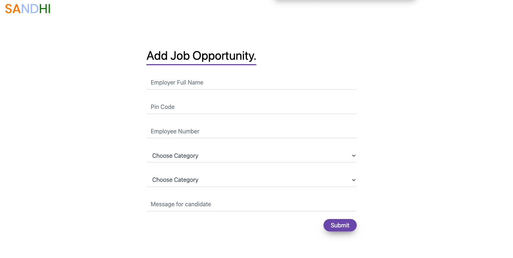
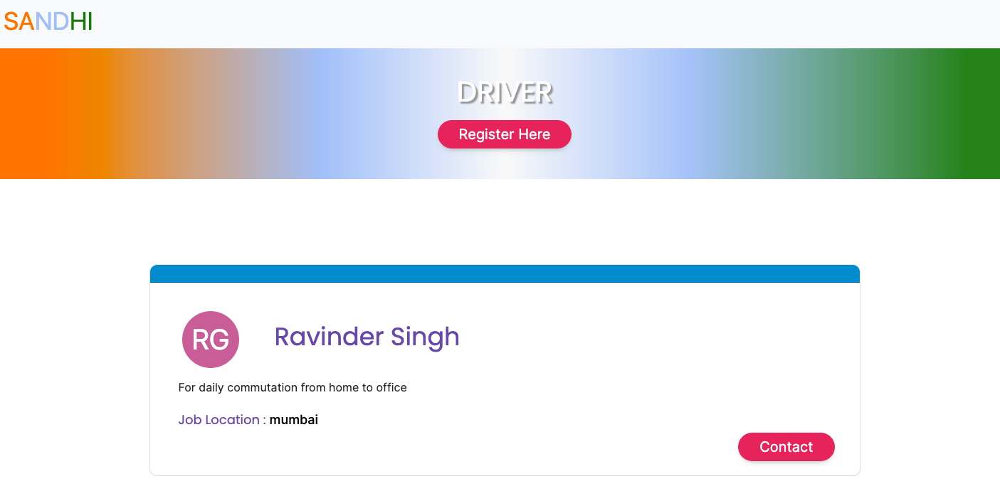
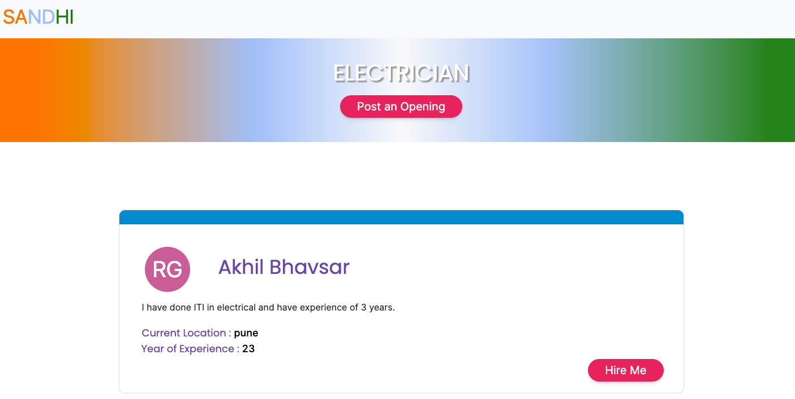

# Sandhi 
##   A job search platform for Blue Collar Workers.

## 🚧 Technology Stack

- **Backend** - Django Rest Framework 
- **Frontend** - ReactJS, HTML, CSS, Javascript
- **Database** - PostgreSQL with redis and celery 
- **SMS service** - Twilio

**Note** : SMS can be sent to only Twilio verified numbers as I am not using the paid service.

## Workflow

I have identified 9 categories of job-seekers to make the platform more intuitive and simple.

- Electrician
- Plumber
- Labour
- Driver
- Maid
- Security guard
- Cook
- Peon
- Mechanic

### For Job Seeker

1. Register
2. Update Profile
3. Apply on jobs - just by clicking - as simple as that.
4. The applicant gets an SMS on his/her phone number after applying to a job.
   

### For Job Poster

1. Post Jobs
2. Get applications on your posted jobs and shortlist.
3. **Ease the flow** for both parties
   - Job Seekers Profiles will be available all throughout, Recruiters can directly see their profiles and give them a message/call

## 🔨 API Endpoints

`/candidates`
| REQUEST  | ENDPOINTS | RESPONSE |
| :-------------- | :-------: | ------------------: |
| GET | /api/candidates | List of requested category jobs |
| POST | /api/candidates | Add new user to database |
| GET | /api/candidates/MECHANIC | List of requested category jobs |
| DELETE | /api/candidates/:id/delete | delete candidate from database  |

`/jobs`
| REQUEST  | ENDPOINTS | RESPONSE |
| :-------------- | :-------: | ------------------: |
| GET | /api/jobs/ | List of all Jobs |
| POST | /api/jobs/register | Register a Job |
| GET | /api/jobs/MECHANIC | List of jobs of  for requested skill|
| GET | /api/jobs/pune/MECHANIC | List of jobs of requested skill and city|

### Additional Features to be added
1. Verification of jobs/profiles by Aadhar Number Verification/phone number verifcation.
2. Multi-lingual support .
3. Filters according to location, salary etc.
4. Stars/Reviews for job seekers
5. Register by call/ message bot (for workers) - simply call on a support number and automated clicks on phone

### Project Screenshots 

